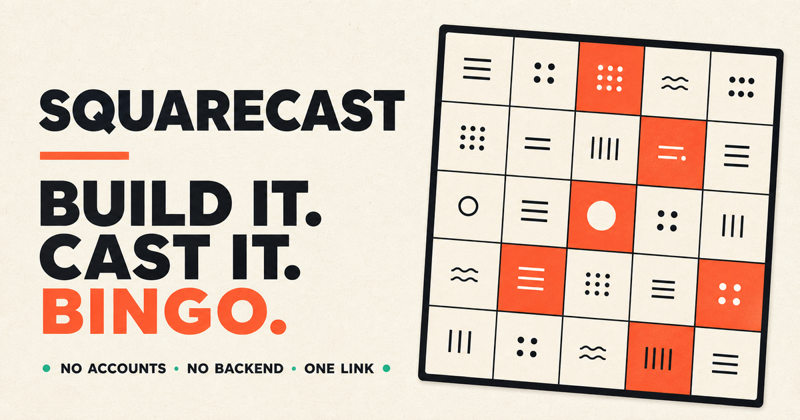

<p align="center">
  
</p>

# Squarecast

Squarecast is a static, URL-native bingo board studio. Build a square board, add more cards than it needs, lock important cards to a cell, row, or column, then send a play link. Each player gets a randomized board.

**Live site:** [mikejhill.github.io/squarecast](https://mikejhill.github.io/squarecast/)

[Open a blank board](https://mikejhill.github.io/squarecast/#new), or open the
front page to receive a randomly selected sample board.

No account, database, cookie, or backend is used. The complete editor or play session is compressed into the URL hash. Only the device-local light, dark, or system appearance preference uses `localStorage`.

## Use Squarecast

1. Open the hosted site to start with one of twelve randomly selected sample boards.
2. Choose a system, light, or dark site appearance from the header, then configure the board size, free-square setting, title, tile font size, and board color.
3. Select **Sample Board** for another curated example or **New Board** for a blank board.
4. Add cards with the quick-add field. Press Enter after each card, use **Paste CSV**, or drop one or more CSV files anywhere on the Card Pool.
5. Optionally constrain a card to a specific cell, row, or column.
6. Select **Test This Board** to test the board immediately, or select **Create Play Link** to share it.
7. Each recipient opens the launch link to create a fresh randomized board. Their marks are written back to their URL as they play.

The URL can be bookmarked or copied at any point. Editing one URL never changes a previously shared URL.

## Features

- 3×3 through 7×7 square boards
- Blank one-click board creation with a fresh randomized color
- Twelve complete, curated sample boards selected randomly on the front page
- Stable `#new` route for linking directly to fresh blank-board creation
- Optional centered free square with a custom label
- Unlimited card pool with live minimum-count validation
- Exact-cell, row, and column placement rules
- Conflict detection before generation
- Seeded randomized boards with one-click reshuffling
- Automatic per-tile text fitting or a fixed custom tile font size
- Keyboard-friendly card entry and editing
- CSV import with quoted-value support
- Persistent card sorting, locked-card prioritization, and shuffling
- Win detection for rows, columns, and diagonals
- Header-level system, light, and dark site appearances on every screen
- Ten named board colors, a custom color picker, and color randomization
- Responsive editor and play layouts
- Compressed, schema-validated URL state
- Back and Forward restoration across major board transitions

## Development

Requirements:

- Node.js 20.19 or newer
- npm

Install and run:

```bash
npm ci
npm run dev
```

Open the local URL printed by Vite.

Quality checks:

```bash
npm run check
```

`npm run check` runs strict TypeScript compilation, the production build, and
coverage-gated behavioral tests. Every domain source file must maintain at
least 90% statement and line coverage, 80% branch coverage, and 100% function
coverage.

Create a production build:

```bash
npm run build
```

The static output is written to `dist/`.

## Project structure

- `src/App.tsx` — top-level state, appearance, and feature composition
- `src/app/` — application service composition and shared state-transition types
- `src/components/` — reusable header, panel, modal, preview, validation, and text-fitting views
- `src/controllers/` — class-based editor and player interaction coordinators
- `src/features/editor/` — focused editor page, setup, Card Pool, dialogs, rows, and preview views
- `src/features/play/` — focused play-session view
- `src/services/` — browser clipboard and rendered-text measurement adapters
- `src/data/sample-board-definitions.ts` — immutable curated sample content
- `src/lib/model.ts` — versioned schemas and default state
- `src/lib/codec.ts` — compressed URL encoding and decoding
- `src/lib/application-state.ts` — route-to-state restoration
- `src/lib/navigation.ts` — pending History API write coordination
- `src/lib/editor-state.ts` — immutable editor mutations
- `src/lib/player-session.ts` — immutable play-session mutations
- `src/lib/generator.ts` — validation, constrained randomization, and win detection
- `src/lib/csv.ts` — CSV card parser
- `src/lib/theme.ts` — appearance resolution, color palettes, contrast, and random colors
- `src/lib/preferences.ts` — device-local site appearance preference
- `src/lib/logger.ts` — scoped, privacy-conscious browser runtime logging
- `src/lib/routes.ts` — special front-page and new-board hash routes
- `src/lib/sample-boards.ts` — sample definition-to-editor catalog behavior
- `src/lib/sorting.ts` — Card Pool sorting strategies
- `tests/` — behavioral tests for state, parsing, color logic, sorting, randomization, constraints, and wins
- `.github/workflows/deploy-pages.yml` — tested GitHub Pages deployment

## State and privacy

Squarecast writes all board, editor, and play-session state to `window.location.hash` using the History API. Shared URLs therefore contain the complete board and never depend on state from another device.

The special `#new` fragment is an action route rather than persisted board
state. Opening it creates a fresh blank board with default settings and a new
random color. The first board edit replaces that action route with the complete
encoded editor state. Opening the hash-free front page similarly chooses a
random sample, then writes that complete sample state into the URL.

The sole browser-storage exception is `squarecast:appearance` in `localStorage`. It stores only `system`, `light`, or `dark`. Appearance is a device-local UI preference rather than board data, so it follows the user across every Squarecast screen without changing shared links. Squarecast does not use `sessionStorage`, cookies, tracking scripts, or network APIs.

Anyone who receives a Squarecast URL can read the board data embedded in it. Do not place secrets or sensitive information in a board.

## Runtime diagnostics

Squarecast uses `loglevel`, a small browser-focused logging library. Each
application service creates a named logger, but the shipped runtime threshold
is fixed at `warn`. Debug and informational calls document normal control flow
for development without appearing in a user's console. Recoverable degradation
uses `warn`; failed operations and invariant violations use `error`.

Logging is local to the browser console. Squarecast has no telemetry endpoint,
log transport, analytics service, or remote error collector. Diagnostics record
operation types, counts, modes, and normalized error messages. They must not
include card text, board titles, encoded hash state, share URLs, or clipboard
contents. The log threshold is not persisted and does not create another
browser-storage exception.

## Contributing

1. Create a branch from `main`.
2. Make a focused change.
3. Add or update tests.
4. Run `npm run check`.
5. Open a pull request describing the behavior change and test coverage.

Keep the project fully static and URL-native. Do not add server state or browser storage beyond the documented site-appearance preference.

## Architecture

Squarecast uses strict TypeScript and class-based application, controller,
domain, and browser-adapter services. State encoding, parsing, board generation,
sorting, editor mutations, play-session mutations, navigation intent, local
appearance preferences, clipboard behavior, rendered text measurement, and
application bootstrapping are encapsulated behind typed classes.

React function components remain declarative because hooks are React's native
composition model. Components are divided by feature and delegate imperative
behavior to controllers and services. `App.tsx` is intentionally limited to
global composition rather than containing editor or player implementation.

Class and method JSDoc explains responsibility, invariants, algorithms, and
failure behavior. Keep comments focused on decisions that cannot be recovered
from syntax alone; update them with the implementation rather than narrating
individual statements.

## License

MIT
