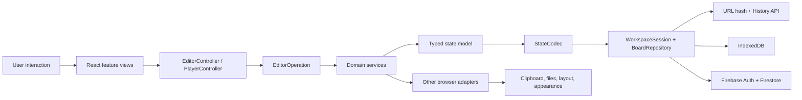
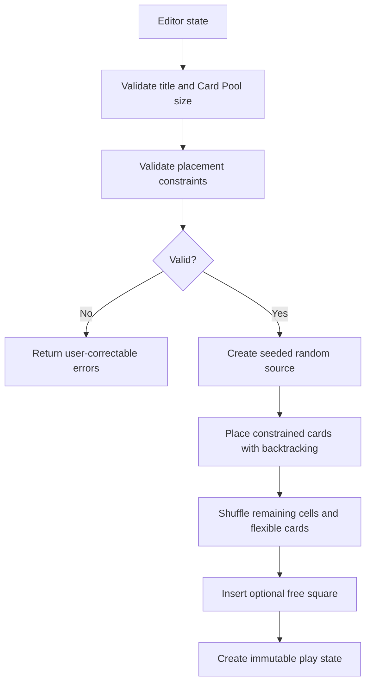

# Architecture

Squarecast is a static React application hosted on GitHub Pages. The browser
owns validation, randomization, state restoration, file import/export, and play
progress. Optional account persistence uses managed Firebase Authentication and
Firestore directly from the browser; there is no application server, Cloud
Function, worker, or server session.

## Architectural Principles

1. **URL compatibility.** A board remains portable and fully usable without an
   account or reachable cloud service.
2. **Trusted domain boundaries.** URL and file input must pass schema
   validation before entering application state.
3. **Deterministic generation.** A stored seed must reproduce the same play
   board.
4. **Declarative views, class-based behavior.** React components render and
   collect transient UI state; controllers and services implement behavior.
5. **Immutable state transitions.** Domain mutations return new state objects
   and never modify prior browser-history entries.
6. **Explicit persistence boundaries.** URL, IndexedDB, and Firestore adapters
   consume the same validated semantic operations.
7. **Explicit browser adapters.** Clipboard, downloads, rendered text
   measurement, History API access, and local preferences sit behind focused
   classes.

## Runtime Layers



### Application composition

`ApplicationServices` constructs the long-lived service graph. `useWorkspace`
resolves asynchronous routes and owns the `WorkspaceSession` around active
editor/play state. The session identifies its storage kind, record, permission,
revision, synchronization state, and historical-view state. `App` composes the
workspace, appearance, feature pages, account, library, sharing, and history
dialogs.

### Feature views

`src/features/editor/` and `src/features/play/` contain page-level React
components. These components:

- render typed state;
- own transient presentation state such as an open dialog or copied indicator;
- translate DOM events into controller calls; and
- do not implement generation, persistence, sorting, or navigation policy.

Shared presentation components live in `src/components/`.

### Controllers

Controllers provide the use-case boundary between React and the domain:

- `EditorController` coordinates Card Pool mutations, configuration changes,
  validation, imports, exports, preview shuffling, testing, and link creation.
- `PlayerController` coordinates cell marking, reshuffling, source editing, and
  session copying.

Controllers decide whether a major action creates a browser-history checkpoint.
They emit a canonical `EditorOperation` for meaningful editor changes and
receive dependencies through `ApplicationServices`.

### Domain services

Classes under `src/lib/` implement application rules:

- state schemas and board calculations;
- immutable editor and player mutations;
- validation and randomization;
- duplicate detection and sorting;
- URL encoding and restoration;
- action-route interpretation;
- appearance resolution and preference handling;
- JSON and CSV serialization; and
- runtime logging.

`EditorOperation` is a runtime-validated discriminated union for configuration
patches, Card Pool additions/edits/deletions, sorting, imports, and complete
replacement. `applyEditorOperation` is the single immutable interpretation
path used by device and cloud repositories. Operation IDs make cloud replay
idempotent.

These classes avoid direct React dependencies and are the primary unit-test
surface.

### Browser adapters

Classes under `src/services/` isolate browser-only capabilities:

- clipboard writes;
- in-memory file downloads; and
- rendered text measurement;
- IndexedDB device persistence and pending cloud operations;
- Firebase initialization and authentication; and
- Firestore board, sharing, presence, and checkpoint access.

Separating adapters keeps domain logic testable and makes local versus remote
side effects explicit during review.

## Persistence And Collaboration

`BoardRepository` defines create, list, load, apply, presentation-save,
duplicate, delete, checkpoint-list, and restore behavior. The IndexedDB and
Firestore implementations store independently versioned records containing the
validated compact `#sq1:` editor payload and metadata.

The device repository performs atomic read/write transactions, retains the
latest 25 meaningful checkpoints, and announces cross-tab changes with
`BroadcastChannel`. Appearance remains in `localStorage`; board data never does.

`CloudSyncCoordinator` applies operations optimistically, persists only
unacknowledged operations in IndexedDB, coalesces same-target typing for 750 ms,
and commits major changes immediately. Firestore transactions read the current
head, apply one semantic operation, increment the revision, update active
published copies, and retry concurrent writes. Different targets merge. An edit
against a deleted target becomes a recoverable conflict. Recent operation IDs
make reconnect replay safe.

Cloud board listeners reapply local pending operations over the latest remote
head. Presence uses a board subcollection, one visible-session heartbeat per
minute, immediate cleanup when a page hides or exits, and a two-minute freshness
cutoff for abandoned sessions. Multiple sessions with the same Firebase UID are
shown as one editor. Presence deliberately excludes cursors and character-level
CRDT behavior.

Editor links use Firebase Anonymous Authentication as a transparent Security
Rules identity; recipients do not see a login prompt. A small board-scoped
editor-session document binds that anonymous UID to the board's currently
active editor token. Rules require both the session and token to remain active
for every board read or write, so rotation and revocation fail closed without a
server. Anonymous sessions do not enter the permanent account member list. If
the recipient signs in or creates an account, Firebase links credentials where
possible and the active editor route adds that account as a normal editor.

Cloud payloads are rejected above 750 KiB. The active editor remains usable for
URL snapshot copy and JSON export when Firebase is unavailable or quota-limited.

## Managed Provider Decision

Firebase Spark is the primary account provider because the browser can use
managed Authentication, Firestore transactions/listeners, Security Rules, and
App Check while GitHub Pages remains the only web host.

Documented alternatives remain:

- Supabase provides a stronger relational permission model, but free projects
  can pause after low activity and require restoration. See
  [Free project pausing](https://supabase.com/docs/guides/platform/free-project-pausing).
- Cloudflare Workers and D1 provide managed runtime and database primitives,
  but Squarecast would need to build and operate its own identity, invitation,
  authorization, and realtime collaboration APIs. This is an architectural
  inference from [Workers pricing](https://developers.cloudflare.com/workers/platform/pricing/)
  and [D1 pricing](https://developers.cloudflare.com/d1/platform/pricing/).

## State Model

All persisted application state is versioned.

| Mode | Purpose | Important contents |
| --- | --- | --- |
| `edit` | Restorable board source | Configuration, Card Pool, placement constraints, sort mode, setup disclosure state, preview seed |
| `launch` | Shareable board template | Complete editor source; opening it creates a fresh randomized play state |
| `play` | One active board | Generated cells, checked indexes, source editor, theme, typography, and seed |

Zod schemas in `src/lib/model.ts` form the trust boundary for decoded URL
state. The portable board-file format applies the same configuration and
placement schemas.

`CompactStateSerializer` is the transport adapter between the model and the URL
codec. It removes repeated property names, encodes small enums numerically, and
references generated play cells by Card Pool index. Decoding first validates
the compact tuple, reconstructs the normal model, and then validates that model
again. The codec still accepts the earlier object-based payload for existing
links.

## Board Generation



Constrained cards are ordered by the number of cells they may occupy. The
generator then uses backtracking to find a collision-free assignment. This
smallest-domain-first approach detects impossible rule combinations before any
play link is created.

Flexible cards and remaining cells are shuffled with a deterministic
pseudorandom source derived from the play seed. Extra cards increase variety;
only the number required to fill the board is selected.

## Live Preview

A valid editor uses the production generator for its preview. An incomplete or
otherwise invalid editor uses a partial-preview path that:

- randomizes available cards;
- preserves the optional free square;
- fills remaining cells with placeholders; and
- remains available while the user resolves validation errors.

Preview state has its own seed, allowing **Shuffle Preview** to change the
display without changing Card Pool order.

## Rendered Text Fitting

Automatic tile text uses actual browser measurements rather than character
count estimates.

1. `AutoFitText` observes the tile with `ResizeObserver`.
2. `RenderedTextFitter` measures scroll dimensions and glyph bounds.
3. `FontSizeOptimizer` searches downward from the allowed maximum in
   quarter-pixel increments.
4. Font readiness and tile resize events trigger a new measurement.

Each tile is measured independently. A fixed-size mode bypasses measurement and
applies one configured size to every tile.

## Dependency Direction

The intended dependency direction is:

```text
components/features -> controllers -> domain services -> model
                              |
                              +-> browser service interfaces/adapters
```

Domain services must not import React components. Components should not
reimplement domain rules. New browser APIs should be wrapped in a focused
adapter instead of being distributed through feature components.

## Related Documents

- [State and Routing](state-and-routing.md)
- [Design and UX](design-and-ux.md)
- [Development](development.md)
