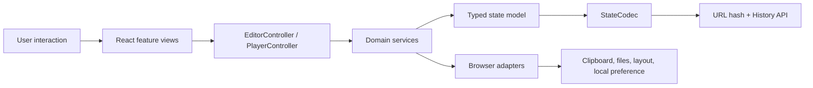
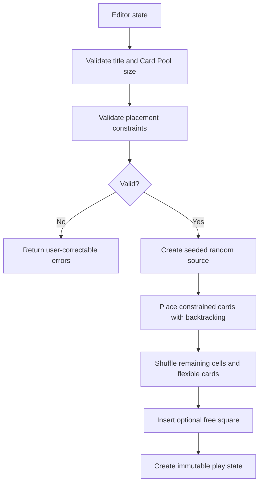

# Architecture

Squarecast is a static React application. It has no application server, remote
database, or authenticated API. The browser owns the complete runtime:
validation, randomization, state restoration, file import and export, and play
progress.

## Architectural Principles

1. **URL-native state.** A board must remain portable without an account or
   backend.
2. **Trusted domain boundaries.** URL and file input must pass schema
   validation before entering application state.
3. **Deterministic generation.** A stored seed must reproduce the same play
   board.
4. **Declarative views, class-based behavior.** React components render and
   collect transient UI state; controllers and services implement behavior.
5. **Immutable state transitions.** Domain mutations return new state objects
   and never modify prior browser-history entries.
6. **Explicit browser adapters.** Clipboard, downloads, rendered text
   measurement, History API access, and local preferences sit behind focused
   classes.

## Runtime Layers



### Application composition

`ApplicationServices` constructs the long-lived service graph. `App` owns the
active editor or play state, site appearance, and navigation coordination. It
selects the editor or player feature without implementing either workflow.

### Feature views

`src/features/editor/` and `src/features/play/` contain page-level React
components. These components:

- render typed state;
- own transient presentation state such as an open dialog or copied indicator;
- translate DOM events into controller calls; and
- do not implement generation, persistence, sorting, or navigation policy.

Shared presentation components live in `src/components/`.

### Controllers

Controllers provide the use-case boundary between React and the domain:

- `EditorController` coordinates Card Pool mutations, configuration changes,
  validation, imports, exports, preview shuffling, testing, and link creation.
- `PlayerController` coordinates cell marking, reshuffling, source editing, and
  session copying.

Controllers decide whether a major action creates a browser-history checkpoint.
They receive dependencies through `ApplicationServices`.

### Domain services

Classes under `src/lib/` implement application rules:

- state schemas and board calculations;
- immutable editor and player mutations;
- validation and randomization;
- duplicate detection and sorting;
- URL encoding and restoration;
- action-route interpretation;
- appearance resolution and preference handling;
- JSON and CSV serialization; and
- runtime logging.

These classes avoid direct React dependencies and are the primary unit-test
surface.

### Browser adapters

Classes under `src/services/` isolate browser-only capabilities:

- clipboard writes;
- in-memory file downloads; and
- rendered text measurement.

Separating adapters keeps domain logic testable in a Node environment and makes
browser side effects easy to identify during review.

## State Model

All persisted application state is versioned.

| Mode | Purpose | Important contents |
| --- | --- | --- |
| `edit` | Restorable board source | Configuration, Card Pool, placement constraints, sort mode, preview seed |
| `launch` | Shareable board template | Complete editor source; opening it creates a fresh randomized play state |
| `play` | One active board | Generated cells, checked indexes, source editor, theme, typography, and seed |

Zod schemas in `src/lib/model.ts` form the trust boundary for decoded URL
state. The portable board-file format applies the same configuration and
placement schemas.

## Board Generation



Constrained cards are ordered by the number of cells they may occupy. The
generator then uses backtracking to find a collision-free assignment. This
smallest-domain-first approach detects impossible rule combinations before any
play link is created.

Flexible cards and remaining cells are shuffled with a deterministic
pseudorandom source derived from the play seed. Extra cards increase variety;
only the number required to fill the board is selected.

## Live Preview

A valid editor uses the production generator for its preview. An incomplete or
otherwise invalid editor uses a partial-preview path that:

- randomizes available cards;
- preserves the optional free square;
- fills remaining cells with placeholders; and
- remains available while the user resolves validation errors.

Preview state has its own seed, allowing **Shuffle Preview** to change the
display without changing Card Pool order.

## Rendered Text Fitting

Automatic tile text uses actual browser measurements rather than character
count estimates.

1. `AutoFitText` observes the tile with `ResizeObserver`.
2. `RenderedTextFitter` measures scroll dimensions and glyph bounds.
3. `FontSizeOptimizer` searches downward from the allowed maximum in
   quarter-pixel increments.
4. Font readiness and tile resize events trigger a new measurement.

Each tile is measured independently. A fixed-size mode bypasses measurement and
applies one configured size to every tile.

## Dependency Direction

The intended dependency direction is:

```text
components/features -> controllers -> domain services -> model
                              |
                              +-> browser service interfaces/adapters
```

Domain services must not import React components. Components should not
reimplement domain rules. New browser APIs should be wrapped in a focused
adapter instead of being distributed through feature components.

## Related Documents

- [State and Routing](state-and-routing.md)
- [Design and UX](design-and-ux.md)
- [Development](development.md)
