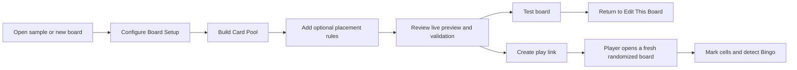

# Design and UX

Squarecast is designed to make a configurable board understandable without
turning the editor into a specialist tool. The interface separates board-wide
decisions, Card Pool work, and the generated result while keeping them visible
in one workspace.

## Product Principles

### Keep the primary flow visible

The editor prioritizes three tasks:

1. configure the board;
2. build and validate the Card Pool; and
3. inspect and share the result.

Board Setup spans the page width. Card Pool and Live Preview remain side by
side on larger screens so editing retains immediate visual feedback.

### Reveal detail when it becomes relevant

Persistent copy is reserved for information required to complete the task.
Secondary explanations use accessible hover/focus tooltips. Placement rules
live with individual cards, and validation appears near the preview and
publishing actions it affects.

### Preserve work in the URL

Routine edits update the current URL without flooding browser history. Major
transitions create history checkpoints. Users can copy, bookmark, or navigate
back to meaningful board states without learning a separate save model.

### Allow imperfect work in progress

An incomplete board still produces a partial preview. Publishing and test-play
actions remain disabled until validation errors are resolved, but exploration
and preview shuffling continue to work.

## User Flow

## Editor Information Architecture

### Global header

The header contains navigation and device-level controls:

- Squarecast home link;
- system, light, and dark appearance;
- fresh-board creation;
- random sample selection;
- current mode label; and
- repository link.

Appearance belongs here because it is a browser preference, not a board
property.

### Board Setup

Board Setup contains settings that affect the whole board:

- title;
- square dimension;
- optional centered free square and label;
- board color;
- automatic or fixed tile text sizing; and
- complete-board JSON import and export.

Related settings share rows on desktop and stack at narrow widths.

### Card Pool

Card Pool supports multiple entry styles:

- type a card and press Enter;
- add with the visible button;
- paste CSV;
- drop CSV files anywhere on the panel;
- edit in place;
- delete;
- sort; and
- assign a placement constraint.

Duplicate text remains permitted because some boards intentionally repeat a
card. It is treated as a warning, with affected cards identified directly in
the pool.

### Live Preview

The preview combines:

- preview shuffling;
- the current board;
- validation status;
- immediate test play; and
- a prominent editor-link action;
- play-link creation.

The editor link is intentionally prominent because the URL is the save and
collaboration mechanism.

## Action Ordering

Horizontal action groups follow one stable convention:

- the primary or forward action appears on the left; and
- the secondary, cancellation, or dismissal action appears on the right.

Dialog actions use the available row width to reinforce this separation.
Peer actions without a primary/dismissal relationship retain task order.

## Play Experience

Play mode reduces the interface to the active board and a small action bar.
Players can:

- mark or unmark cells;
- generate another shuffle;
- copy the exact session;
- return to the source editor; and
- see completed lines highlighted.

The Bingo toast is positioned as an overlay above the board heading so it does
not move the board or change page layout.

## Typography and Tile Fitting

Text-only cells must remain readable without clipping.

- **Auto** measures each tile independently against its rendered container.
- The maximum automatic size is capped so short labels do not dominate a board.
- Wrapping is browser-driven and remeasured when the tile or loaded fonts
  change.
- **Fixed** applies one explicit size to the complete board.

Text fitting is documented technically in
[Architecture](architecture.md#rendered-text-fitting).

## Color and Appearance

Board color and site appearance are separate concepts:

- board color is shareable board state;
- site appearance is a device-local preference.

The application offers preset board colors, a custom color picker, and color
randomization. Contrast utilities derive readable foreground and supporting
colors from the selected accent.

System appearance is the default. The root element exposes a correct
`color-scheme`, allowing native controls and tools such as Dark Reader to
recognize the active appearance.

## Accessibility

UI changes should preserve:

- visible keyboard focus;
- labels for icon-only controls;
- native buttons, inputs, and selects;
- `aria-pressed` for toggle-like controls and board cells;
- status or alert roles for meaningful feedback;
- keyboard-accessible tooltips;
- adequate light and dark contrast;
- reduced-motion handling; and
- readable controls at touch sizes.

Board state must not be communicated by color alone. Checked cells, duplicate
warnings, validation results, and winning lines all include structural or icon
cues.

## Responsive Behavior

The desktop editor uses a full-width setup band followed by a two-column
workspace. At narrower widths:

- Card Pool and Live Preview stack;
- multi-column setup fields collapse;
- header labels reduce before controls disappear;
- Card Pool rows reorganize without hiding placement settings; and
- board cells preserve a square aspect ratio.

Responsive changes should retain task order. Reflow may change columns, but
Board Setup must still precede Card Pool, and Card Pool must precede Live
Preview.

## Content Guidelines

- Use direct, neutral language.
- Use **Card** for Card Pool entries.
- Use **Board** for the complete grid or its configuration.
- Name actions by their outcome: **Test This Board**, **Create Play Link**,
  **Copy Editor Link**.
- Avoid jokes at the expense of professions, groups, or routine obligations.
- Sample boards should be broadly usable, complete, and independently themed.
- Keep permanent instructional text short; move secondary explanation to
  contextual help.

## Reviewing UX Changes

Check each change against these questions:

1. Is the primary action visible where the decision is made?
2. Does the change add vertical height or persistent copy that could be
   contextual instead?
3. Can the interaction be completed with a keyboard?
4. Does it work in light, dark, and system appearance?
5. Does it preserve URL restoration and browser history?
6. Does an incomplete board remain understandable and recoverable?
