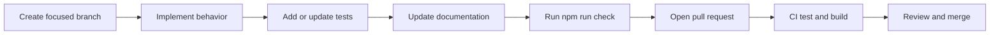

# Development

This guide describes the repository structure, local workflow, implementation
conventions, and review expectations for Squarecast.

## Requirements

- Node.js 20.19 or newer
- npm
- A modern browser for interactive testing

## Setup

```bash
npm ci
npm run dev
```

Vite prints the local development URL. The development server supports
hot-module replacement.

## Commands

| Command | Purpose |
| --- | --- |
| `npm run dev` | Start the Vite development server |
| `npm test` | Run the Vitest suite once |
| `npm run test:watch` | Run tests during development |
| `npm run test:coverage` | Run tests with per-file coverage thresholds |
| `npm run build` | Run strict TypeScript compilation and build static assets |
| `npm run preview` | Serve the production build locally |
| `npm run check` | Run coverage validation and the production build |

## Repository Structure

```text
.
├── .github/workflows/       GitHub Pages CI/CD
├── docs/                    Technical and product documentation
├── public/                  Static public assets
├── src/
│   ├── app/                 Service composition and shared app types
│   ├── components/          Reusable React presentation components
│   ├── controllers/         Editor and player use-case coordination
│   ├── data/                Immutable curated content
│   ├── features/            Editor and play feature views
│   ├── lib/                 Domain services, schemas, and policies
│   ├── services/            Browser API adapters
│   ├── App.tsx              Global state and feature composition
│   ├── main.tsx             Application bootstrap
│   └── styles.css           Site-wide visual system and responsive rules
├── tests/                   Behavioral unit tests
├── index.html               Static application entry document
├── vite.config.ts           Production base-path configuration
└── vitest.config.ts         Test discovery and coverage policy
```

## Responsibility Boundaries

### React components

Components render state and own short-lived presentation details. Use function
components and hooks because they are React's native composition model.

Do not put board generation, state encoding, sorting, persistence policy, or
other domain rules in a component.

### Controllers

Add a controller method when a user intent coordinates more than rendering:

- call one or more domain services;
- choose a browser-history policy;
- invoke a browser adapter; or
- translate a domain result into application state.

Controllers should remain usable without rendering a component.

### Domain classes

Put reusable rules under `src/lib/`. Prefer a focused class with explicit
dependencies over unrelated utility functions. Keep mutations immutable and
make trust boundaries visible through typed schemas.

### Browser services

Wrap direct browser side effects under `src/services/`. This includes APIs such
as clipboard, file download, and DOM measurement. A browser service should do
one job and expose a small typed contract.

## TypeScript Policy

The project uses strict compile-time settings, including:

- `strict`;
- `noImplicitReturns`;
- `noFallthroughCasesInSwitch`;
- `noUncheckedIndexedAccess`;
- `noUnusedLocals`;
- `noUnusedParameters`; and
- `forceConsistentCasingInFileNames`.

Avoid `any`, unchecked type assertions, and parallel definitions of the same
domain shape. Infer types from Zod schemas where runtime validation is needed.

## Class and Method Documentation

Public classes should state:

- their responsibility;
- the boundary they own;
- important invariants; and
- why the abstraction exists.

Public methods should explain behavior or failure semantics that cannot be
recovered from the signature. Comments should document decisions, not narrate
individual statements.

## Testing

Vitest runs in a Node environment. Domain services and controllers form the
primary test surface.

Per-file coverage requirements are:

| Metric | Minimum |
| --- | ---: |
| Statements | 90% |
| Lines | 90% |
| Branches | 80% |
| Functions | 100% |

Coverage is a gate, not the test-design objective. Tests should exercise
observable behavior, edge conditions, compatibility, and failure paths.
Avoid assertions that only repeat an implementation constant without proving a
contract.

Examples of meaningful tests include:

- URL state round trips and malformed input rejection;
- impossible placement constraints;
- deterministic generation from a seed;
- complete sample-board generation;
- import/export round trips;
- history checkpoint policy;
- immutable editor and player mutations; and
- logging redaction and level behavior.

## Common Change Patterns

### Add a board configuration field

1. Extend the Zod schema and inferred type in `model.ts`.
2. Decide whether a default can preserve older links.
3. Update board factories and sample creation.
4. Add immutable mutation behavior if required.
5. Add editor controls and play rendering.
6. Update JSON compatibility expectations.
7. Test URL and JSON round trips.
8. Update the relevant documentation.

### Add a sample board

1. Add an immutable definition under `src/data/`.
2. Use a distinct ID, title, and accent color.
3. Supply exactly 24 cards with a free square or 25 without one.
4. Keep the board broadly usable and unoffensive.
5. Run the sample catalog test, which validates every board and generated cell.

Sample dimensions are fixed by `SampleBoardCatalog`; definitions do not choose
their own size.

### Add a placement rule

1. Extend the discriminated placement schema.
2. Define allowed cells in `BoardGenerator`.
3. Update geometry-cleanup behavior in `EditorStateService`.
4. Add the Card Pool control.
5. Cover satisfiable, conflicting, and boundary cases.
6. Update [Data Formats](data-formats.md).

### Add a browser capability

1. Create a focused adapter under `src/services/`.
2. Instantiate it in `ApplicationServices`.
3. Invoke it from a controller.
4. Keep browser globals out of domain classes.
5. Test controller behavior with a fake adapter.

## Pull Request Workflow



A pull request should explain:

- the user-visible or architectural problem;
- the chosen behavior;
- important tradeoffs;
- validation performed; and
- compatibility or privacy impact.

## Review Checklist

- Domain behavior is outside React components.
- State changes are immutable.
- URL and browser-history behavior is intentional.
- Imported or decoded input is validated.
- Logs contain no board content or URLs.
- Light, dark, system, keyboard, and narrow-screen behavior were considered.
- Tests prove behavior rather than implementation trivia.
- Documentation describes the durable contract, not the sequence of changes.

## Related Documents

- [Architecture](architecture.md)
- [Design and UX](design-and-ux.md)
- [Operations](operations.md)
