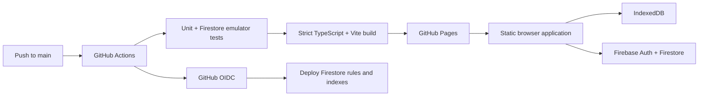

# Operations

Squarecast serves static assets from GitHub Pages. Optional account storage uses
managed Firebase Authentication and Firestore directly from the browser. There
is no application server, Cloud Function, Firebase Hosting site, Cloud Storage,
queue, or remote log collector.

## Production Topology



Cloud configuration is public repository/deployment metadata, not a secret.
Firestore Security Rules, account or anonymous Firebase identity, random
tokens, and App Check form the authorization boundary.

## Firebase Project Setup

Use one Firebase Spark project:

1. create a Firebase project without Analytics;
2. create a Firestore Standard database in the US multi-region matching the
   configured rules and indexes;
3. register a Web app without enabling Firebase Hosting;
4. enable Google, Email/Password, and Anonymous authentication;
5. add `mikejhill.github.io` and required local-development hosts to authorized
   Authentication domains;
6. configure password-reset and verification email templates;
7. register a reCAPTCHA Enterprise App Check provider for the Web app;
8. deploy `firestore.rules` and `firestore.indexes.json`; and
9. observe App Check metrics before enabling enforcement.

Keep the project on Spark. Quota exhaustion must hard-fail into the existing
**Cloud Unavailable** state; never attach a billing account solely to avoid an
application failure. URL/device editing, JSON export, snapshot links, and
existing play sessions remain functional without Firebase.

References: [Firebase pricing plans](https://firebase.google.com/docs/projects/billing/firebase-pricing-plans),
[Firestore quotas](https://firebase.google.com/docs/firestore/quotas),
[Web Authentication](https://firebase.google.com/docs/auth/web/start),
[Anonymous Authentication](https://firebase.google.com/docs/auth/web/anonymous-auth),
[Security Rules](https://firebase.google.com/docs/firestore/security/get-started),
and [App Check for Web](https://firebase.google.com/docs/app-check/web/recaptcha-provider).

## Build Configuration

Copy `.env.example` to `.env.local` for local cloud testing. Vite exposes these
values in the browser bundle:

```text
VITE_FIREBASE_API_KEY
VITE_FIREBASE_AUTH_DOMAIN
VITE_FIREBASE_PROJECT_ID
VITE_FIREBASE_STORAGE_BUCKET
VITE_FIREBASE_MESSAGING_SENDER_ID
VITE_FIREBASE_APP_ID
VITE_FIREBASE_APP_CHECK_SITE_KEY
```

If required Firebase values are absent, `FirebaseClient` stays disabled and the
site exposes URL/device operation with an explicit cloud-unavailable message.
Never put service-account keys or private credentials in `VITE_*` values.

Configure the Firebase API key as the GitHub Actions repository secret
`FIREBASE_API_KEY`. Configure the remaining Firebase values as repository
variables without the `VITE_` prefix. The Pages build maps them into Vite.
Also configure:

```text
GCP_WORKLOAD_IDENTITY_PROVIDER
GCP_FIREBASE_SERVICE_ACCOUNT
```

The service account must be impersonable only by this repository/branch through
GitHub Workload Identity Federation. Give it only the permissions required to
create Firebase Rules rulesets/releases and manage Firestore indexes. Do not use
a downloaded service-account key or broad project Owner/Editor role.

## Continuous Delivery

`.github/workflows/deploy-pages.yml` runs on `main` pushes and manual dispatch:

1. install the locked dependency graph;
2. install Java 21;
3. start the Firestore emulator and run Security Rules tests;
4. run coverage-gated unit tests;
5. run strict TypeScript and build with the GitHub Pages base path;
6. upload and deploy the static Pages artifact; and
7. conditionally authenticate through GitHub OIDC and deploy Firestore rules and
   indexes when cloud variables are configured.

The Firestore policy job never blocks URL/device builds merely because a cloud
project has not been configured. Once production cloud storage is enabled,
missing policy-deployment variables are a release-configuration defect and must
be corrected before advertising cloud storage.

## Security Policy

`firestore.rules` enforces:

- account membership for private board pointers;
- active-token-bound anonymous sessions for editor links;
- owner/editor role boundaries;
- owner-only access management and deletion;
- monotonic revision increments and conservative payload size;
- a maximum of 20 members;
- restricted field changes for editor writes;
- get-only, non-listable public token documents;
- perpetual editor tokens that fail closed after rotation or revocation; and
- member-or-active-guest checkpoint and presence access.

Anonymous guests are authenticated Firebase users, not unauthenticated
Firestore clients. Their board-scoped editor-session document must match the
board's current editor token. A guest save may update board content and
revision metadata but cannot change ownership, members, or sharing references.

`firestore.indexes.json` indexes membership and updated-time lookup while
exempting state payloads and role/token maps from unnecessary indexing. Every
rule change requires an emulator test covering the allowed path and adjacent
denied paths.

## Firestore Request Budget

- Private board opening uses one board subscription; its initial snapshot is
  the load. Do not precede it with `getDoc()`.
- Public live view uses one share subscription. Public play uses one share read
  before becoming a self-contained URL session.
- Share opens from owner access metadata already carried by the board listener.
  Copying a displayed link performs no validation read.
- Presence writes once on visible entry, once per existing one-minute interval,
  and once on visible exit. Overlapping lifecycle events are idempotent. Owner
  stale cleanup is one non-blocking query plus one bounded batch.
- Routine typing commits after 1.5 seconds idle and no later than five seconds
  after the first pending edit. Structural operations commit immediately.
- Listener rendering overlays queued and in-flight local operations, excluding
  operation IDs already present in the received board revision. Older save
  acknowledgements cannot visibly roll a field back while a newer edit waits.

Firestore listeners still incur an initial document read and another read when
a matching document changes. Transactions read the current board and may retry
during contention. App Check initializes at the first Firestore operation, not
at application startup. URL-only and device-only routes must produce no App
Check request. Firestore persistent caching is intentionally disabled.

## Runtime Logging

`RuntimeLogger` wraps scoped `loglevel` loggers. Production remains fixed at
`warn`. Logs stay in the local console and may contain counts, encoded length,
error type, normalized messages, and safe enum values. They must never contain
Card Pool text, board titles, full state, encoded hashes, public/invite tokens,
share URLs, clipboard contents, imported content, or Firebase documents.

## Failure And Recovery

| Failure | Application response |
| --- | --- |
| Invalid/corrupt `#sq1:` | Open a fresh editor |
| Missing `#sql1:` record | Show device Not Found; preserve route |
| Missing/removed private board | Show Not Found or Access Removed |
| Signed-out private route | Show Auth Required; preserve route |
| Signed-out editor route | Create an anonymous guest identity and preserve the token route |
| Rotated/revoked editor route | Remove guest access and show Board Unavailable |
| Revoked public token | Fail closed with Not Found |
| IndexedDB failure/quota | Keep active URL state and expose snapshot/JSON export |
| Firestore blocked/offline | Persist unacknowledged operations in IndexedDB |
| Firestore quota/provider failure | Show Cloud Unavailable; keep active editor |
| Same-target collaboration conflict | Name the affected target, state that local work will save automatically, then confirm resolution |
| Invalid JSON/CSV | Keep current board; reject partial replacement |

Before sign-out, checkpoint restore, or account deletion, Squarecast flushes
pending cloud operations and blocks the destructive action if work remains.
Account deletion removes/withdraws board memberships before deleting Firebase
Authentication. Failed cleanup preserves export and retry paths.

For production diagnosis, use non-sensitive sample content, inspect local
`squarecast:*` warnings/errors, check the Pages and policy workflow jobs, verify
Firebase Auth/Firestore/App Check dashboards, and reproduce with a production
build. Never request a full private board URL or log a token.

## Deployment Verification And Rollback

A green workflow proves rules tests, coverage thresholds, strict compilation,
the production build, and Pages artifact deployment. When configured, the
policy job also proves OIDC authentication and rules/index deployment. It does
not prove provider-console setup, App Check enforcement, quota headroom, or
multi-browser collaboration; verify those manually with signed-in, anonymous,
incognito, offline, and reopened-editor-link sessions.

Rollback application code with a normal revert commit. Roll back rules/indexes
through reviewed repository changes and the same OIDC workflow. Do not edit
production rules ad hoc in the Firebase console except during an active access
incident, and immediately reconcile any emergency change into the repository.

## Related Documents

- [State and Routing](state-and-routing.md)
- [Architecture](architecture.md)
- [Development](development.md)
- [Privacy](privacy.md)
