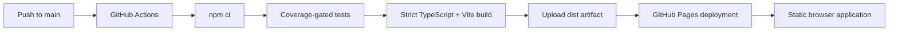

# Operations

Squarecast is deployed as static assets on GitHub Pages. Operational concerns
therefore center on build integrity, browser compatibility, privacy-conscious
diagnostics, and safe recovery rather than server health.

## Production Topology



There is no application server, worker, database, queue, object store, or
runtime secret.

## Continuous Integration and Deployment

`.github/workflows/deploy-pages.yml` runs on:

- pushes to `main`; and
- manual workflow dispatch.

The workflow:

1. checks out the repository;
2. installs the locked dependency graph with `npm ci`;
3. runs the coverage-gated test suite;
4. builds with the GitHub Pages base path;
5. uploads `dist/` as the Pages artifact; and
6. deploys only after test and build success.

The Pages concurrency group cancels an obsolete in-progress deployment when a
newer commit arrives.

## Runtime Logging

Squarecast uses `loglevel` through the `RuntimeLogger` class. Every logger has a
scope such as:

```text
squarecast:board-generator
squarecast:state-codec
squarecast:editor-controller
```

The production threshold is fixed at `warn`.

| Level | Intended use | Production console |
| --- | --- | --- |
| `debug` | Detailed control flow and measurements | Suppressed |
| `info` | Successful lifecycle events | Suppressed |
| `warn` | Recoverable degradation or rejected input | Visible |
| `error` | Failed operation or violated invariant | Visible |

Passing `false` when configuring loglevel prevents the threshold from becoming
another stored preference.

### Logging rules

Logs may contain:

- operation name;
- state mode;
- item counts;
- encoded length;
- error type and normalized message; and
- safe enum values.

Logs must not contain:

- Card Pool text;
- board titles;
- full editor or play state;
- encoded URL fragments;
- share URLs;
- clipboard contents; or
- imported file contents.

`RuntimeLogger.error` normalizes unknown errors into a serializable name and
message rather than passing application objects to the sink.

Squarecast has no telemetry endpoint, analytics SDK, remote log transport, or
error-reporting service. Logs remain in the local browser console.

## Failure Behavior

| Failure | Application response |
| --- | --- |
| Invalid or corrupt URL state | Open a fresh editor |
| Invalid JSON board file | Keep current board and show an inline error |
| Non-CSV dropped file | Ignore the file and emit a warning |
| Clipboard unavailable | Keep current state and record a local console error |
| `localStorage` unavailable | Use system appearance in memory |
| Conflicting placement rules | Keep editing enabled and block publishing |
| Incomplete Card Pool | Show partial preview and block publishing |
| Font or container resize | Re-run rendered text fitting |

Fallbacks must preserve the current board whenever possible. Imported content
must never partially replace state.

## Production Diagnosis

For a reported problem:

1. identify whether it affects edit, launch, or play mode;
2. record the browser family and approximate viewport;
3. reproduce with non-sensitive sample content;
4. inspect `squarecast:*` warnings and errors in the browser console;
5. check the deployed workflow commit;
6. compare behavior with a local production build; and
7. add a behavioral regression test where the affected boundary is testable.

Do not request a user's complete board URL if it contains private content.
Prefer a minimal recreated board or exported JSON with sanitized card text.

## Deployment Verification

A successful workflow proves:

- dependencies install from the lockfile;
- coverage thresholds pass;
- strict TypeScript compilation passes;
- the GitHub production base path builds; and
- GitHub Pages accepted the artifact.

It does not prove every browser layout. UI changes should receive proportionate
manual testing in supported modern browsers when layout, focus, drag-and-drop,
or rendered measurement changes.

## Recovery and Rollback

GitHub Pages deploys immutable build artifacts associated with commits. To
recover from a faulty release:

1. identify the last known-good commit;
2. revert the faulty commit with a new commit;
3. push the revert to `main`;
4. allow the normal workflow to test, build, and deploy it; and
5. verify the workflow conclusion and live behavior.

Do not bypass the test-and-build job to force a Pages artifact.

## Dependency and Platform Maintenance

- Keep `package-lock.json` committed.
- Use `npm ci` in automation.
- Review framework, build-tool, validation, icon, compression, and logging
  updates for browser and Node engine changes.
- Treat changes to Zod schemas, LZ-String behavior, Vite base paths, or History
  API coordination as compatibility-sensitive.
- Keep GitHub Actions pinned to explicit major versions.
- Run the complete quality gate after dependency updates.

## Privacy Boundary

The application is operationally private by architecture:

- board state stays in the URL fragment;
- file import and export remain local;
- no remote application endpoint receives state;
- no analytics or telemetry runs; and
- only appearance uses local storage.

Static hosting does not make shared URLs confidential. The recipient of a full
URL can restore the board it contains.

## Related Documents

- [State and Routing](state-and-routing.md)
- [Architecture](architecture.md)
- [Development](development.md)
