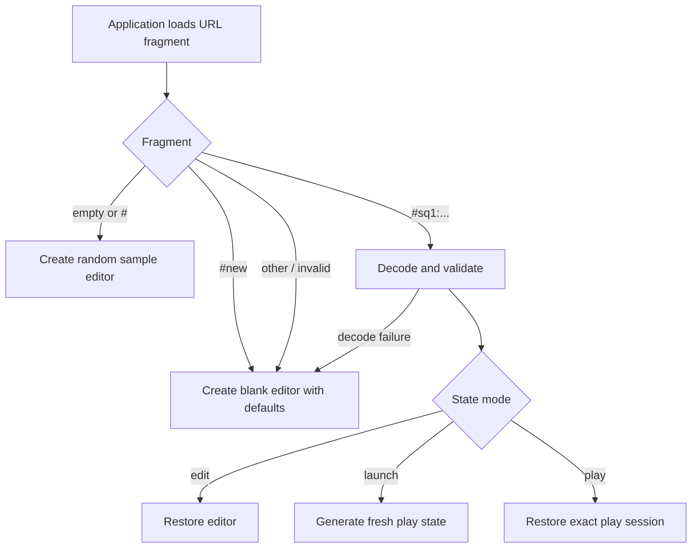
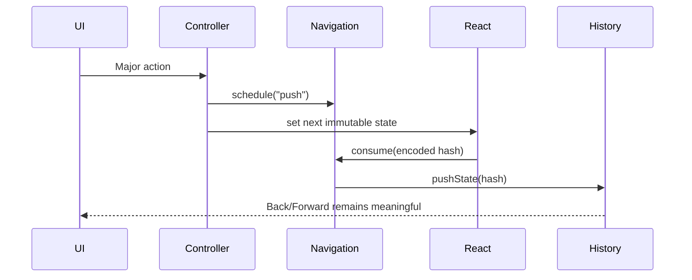

# State and Routing

Squarecast treats the URL as its board document. This design makes editor and
play sessions portable across tabs and devices without server-side persistence.

## State Sources

| Source | Stored data | Scope |
| --- | --- | --- |
| URL fragment | Editor, launch, or play state | Shareable and restorable |
| `#new` action route | Instruction to create fresh defaults | Shareable action |
| Empty fragment | Instruction to select a sample | Landing behavior |
| `localStorage` | `system`, `light`, or `dark` appearance | Current browser only |
| React component state | Dialogs, copy feedback, drag state | Current render session |

No board content is stored in cookies, `sessionStorage`, IndexedDB, or a remote
service.

## Encoded State

`StateCodec` converts state into a versioned compact tuple, compresses that
tuple with LZ-String, and writes it beneath the `#sq1:` prefix. Tuple fields use
numeric codes and positional structure to avoid repeating object-property
names. Generated play cells normally store Card Pool indexes instead of
duplicating Card IDs and text.

```text
https://mikejhill.github.io/squarecast/#sq1:<compressed-state>
```

The fragment is not sent to the web server as part of an HTTP request. It is
read and written by the browser application.

Decoding follows a fail-closed sequence:

1. verify the `#sq1:` prefix;
2. decompress the payload;
3. parse JSON;
4. validate the compact transport tuple;
5. reconstruct the ordinary application state;
6. validate the complete application object with Zod; and
7. accept only a supported state mode and version.

Malformed or incompatible data falls back to a new editor instead of entering
runtime state. Object-based `#sq1:` links issued by earlier Squarecast versions
remain readable.

## Application Modes

### Editor state

Editor state contains:

- board title, dimensions, free-square behavior, color, and text settings;
- Card Pool entries and placement rules;
- selected sort mode; and
- Board Setup disclosure state; and
- live-preview seed.

This is the source of truth used to create launch and play states.

### Launch state

A play link contains a `launch` state whose source is the complete editor.
Opening the link generates a new seed and immediately replaces the launch state
with a concrete play state. Two people opening the same launch link therefore
receive independently randomized boards.

### Play state

Play state contains:

- generated cell order;
- checked cell indexes;
- generation seed;
- display configuration; and
- the source editor.

Retaining the source allows **Edit This Board** to return directly to the board
that produced the session.

## Route Resolution



`#new` is intentionally an action route rather than a fixed empty-board state.
Every opening creates fresh defaults, including a randomized board color.

## History Policy

Squarecast distinguishes high-frequency edits from meaningful transitions.

| Interaction | History behavior | Reason |
| --- | --- | --- |
| Typing a title or editing a card | Replace current entry | Avoid one Back step per keystroke |
| Expanding or collapsing Board Setup | Replace current entry | Preserve the view without adding navigation noise |
| Changing board geometry | Push a new entry | The change can invalidate placement rules |
| New Board or Sample Board | Push a new entry | Preserve the prior board |
| Test This Board | Push a new entry | Preserve the editor |
| Edit This Board | Push a new entry | Preserve the play session |
| Import complete JSON | Push a new entry | Preserve the board being replaced |
| Delete, sort, or bulk-import cards | Push a new entry | Preserve a meaningful collection change |
| Restore with Back or Forward | No write | Prevent restoration from rewriting history |

`NavigationCoordinator` records the policy for the next React commit.
`UrlHistoryService` performs the resulting `pushState`, `replaceState`, or no-op.



## Seeds and Reproducibility

The editor preview, launch generation, and play reshuffle use separate seeds.
Once a play state is created, its generated cells and seed are stored in the
URL. Restoring that play URL reproduces the exact board and checked cells.

Creating a play link does not freeze one board. The link stores a launch
template, and each opening creates a fresh play seed.

## Appearance Preference

Appearance is excluded from board state because it describes the current
browser, not the shared board. The value is stored under:

```text
squarecast:appearance
```

Supported values are `system`, `light`, and `dark`. If storage is unavailable
or contains an unsupported value, Squarecast uses `system`. This is the only
browser-storage exception.

## Privacy and URL Handling

URL fragments make board data portable, not secret. Anyone with the full URL
can restore and inspect the state it contains.

Operational rules:

- never put sensitive data in a board;
- never log encoded hashes, share URLs, titles, or Card Pool text;
- do not add third-party scripts that collect the current URL;
- preserve the static architecture unless a new privacy model is explicitly
  designed; and
- treat state-schema and codec changes as compatibility changes.

## Compatibility

The `sq1` prefix and state field `v: 1` establish the application compatibility
boundary. The transport tuple has its own version, allowing its representation
to evolve without changing the application model or public route. Existing
object payloads and schema defaults preserve compatible older links.

The compressed URL representation is an application format, not a public
hand-editing format. Use the documented JSON board file for external tooling.

## Related Documents

- [Architecture](architecture.md)
- [Data Formats](data-formats.md)
- [Operations](operations.md)
