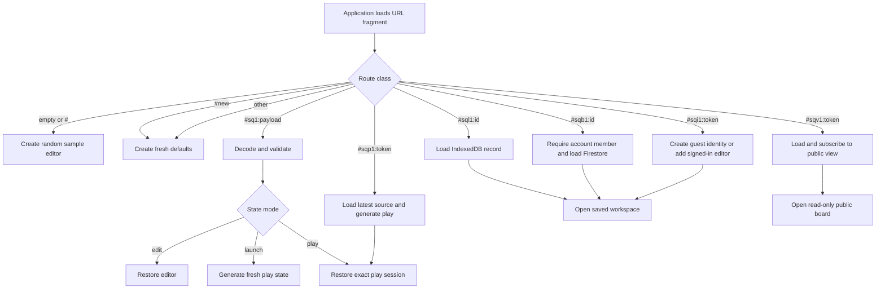

# State and Routing

Squarecast keeps the URL as a complete portable board document while adding
optional device and account pointers. URL-only operation remains independent of
Firebase.

## State Sources

| Source | Stored data | Scope |
| --- | --- | --- |
| `#sq1:` URL fragment | Editor, launch, or play state | Immutable, shareable snapshot |
| `#sql1:` pointer | IndexedDB editor record and checkpoints | Current browser profile |
| `#sqb1:` pointer | Private Firestore editor record and checkpoints | Account members |
| `#sqv1:` bearer pointer | Latest published read-only copy | Anyone holding the active token |
| `#sqp1:` bearer pointer | Latest published launch source | Anyone holding the active token |
| `#sqi1:` editor pointer | Perpetual mutable editor access | Active-token guests or account editors |
| `#new` action route | Instruction to create fresh defaults | Shareable action |
| Empty fragment | Instruction to select a sample | Landing behavior |
| `localStorage` | Appearance preference | Current browser profile |
| React component state | Dialogs, copy feedback, drag state | Current render session |

Device boards and unacknowledged cloud operations use IndexedDB. Account boards
use Firestore. Board data is never stored in cookies, `sessionStorage`, or
`localStorage`.

## Encoded State

`StateCodec` converts state into a versioned compact tuple, compresses that
tuple with LZ-String, and writes it beneath `#sq1:`. Generated play cells
normally store Card Pool indexes instead of duplicating Card IDs and text.

```text
https://mikejhill.github.io/squarecast/#sq1:<compressed-state>
```

The fragment is not sent with the HTTP request. Decoding fails closed:

1. verify the prefix;
2. decompress and parse JSON;
3. validate the compact transport tuple;
4. reconstruct the application state;
5. validate the complete model with Zod; and
6. accept only supported state modes and versions.

Malformed or incompatible `#sq1:` data opens a fresh editor. Earlier
object-based `#sq1:` payloads remain readable.

## Application Modes

An `edit` state contains configuration, Card Pool, placement rules, position-
control visibility, sort mode, Board Setup disclosure, and preview seed. A
`launch` state contains the source editor and generates a new concrete play
state on every opening. A `play` state
contains generated cells, checked indexes, its seed, and the source editor so
**Edit This Board** can return to it.

## Route Resolution



`#new` is an action route. Every opening creates fresh defaults and a random
board color. Saved-route resolution is asynchronous. Missing records,
removed access, revoked tokens, disabled Firebase, and
provider failures produce explicit recoverable route states; none silently
create a replacement board.

Opening `#sqp1:` validates the latest published editor, generates a fresh play
board, and replaces the pointer with a concrete `#sq1:` play session. Play
progress never enters a saved library.

## Storage Promotion And Copies

A URL editor starts with a visible storage preference. Its first meaningful
edit creates a device draft while signed out or an account board while signed
in with a verified account. The user can explicitly retain URL Only behavior.
Disclosure changes, appearance, dialogs, and preview shuffles do not promote.
An anonymous recipient already editing through `#sqi1:` is an active cloud
guest and saves directly to that shared board; first-edit promotion does not
apply to that session.

Existing device boards stay device-only after sign-in. Moving between URL,
device, and account storage always creates an independent copy. It never deletes
the source. **Copy Editor Link** and **Create Play Link** still create
self-contained `#sq1:` snapshots. Mutable view/play links and editor links
are separate cloud actions.

## History Policy

Typing and other high-frequency edits replace the current history entry. Major
transitions push an entry: New Board, Sample Board, geometry changes, Test This
Board, Edit This Board, complete-board import, meaningful deletion, sorting,
bulk import, storage copies, and checkpoint restoration. Back and Forward never
write immediately.

Saved pointer routes remain stable. Anonymous editor-link sessions retain the
`#sqi1:` route so signing in can add the resulting account as an editor.
`history.state.squarecast` stores the encoded snapshot, storage kind, record
ID, revision, and active editor token when applicable. Back or Forward can
therefore show an older saved revision without rewriting storage. Historical
views reject edits until **Restore This Version** writes a new head revision.
**Return To Current** discards the preview without changing storage.

Deterministic, non-destructive transitions render as real `<a href>` links:
New Board, Sample Board, Test This Board, Play This Board, Edit This Board, New
Shuffle, My Boards Open, URL-Only Copy, and Return To Current. Squarecast
intercepts only an unmodified primary activation for SPA history handling.
Modified clicks, middle clicks, context menus, and browser link commands retain
native behavior. Generated Test, Play, Shuffle, and Edit destinations are
concrete `#sq1:` snapshots reused by both same-tab and new-tab activation.

Device and cloud boards retain up to 25 saved versions. New boards begin with a
**Board Created** baseline. Card additions, deletions, sorting, imports, and
structural Board Setup changes create named versions; routine typing remains
coalesced, and showing or hiding Card position controls does not add a named
version. Existing boards without a baseline capture their prior state when the
next named version is created. The Version History dialog identifies the
current revision and provides separate **View** and **Restore** actions.

Cloud presence records one entry per visible browser session, refreshes once
per minute, removes the entry when the page hides or exits when possible, and
ignores abandoned entries after two minutes. The UI collapses simultaneous
sessions with the same Firebase UID into one displayed editor. Anonymous guests
receive a deterministic **Guest Adjective Creature NNN** name.

Private cloud pointers resolve from the first board-listener snapshot instead
of a read followed by a listener. Public views resolve from one share listener.
Public play retains one single share read before replacing itself with a
self-contained play session. Device and public routes do not wait for Firebase
Authentication state.

## Seeds And Reproducibility

Editor preview, launch generation, and play reshuffle use separate seeds. A
concrete play URL reproduces the same generated board and checked cells. A
launch URL creates a new seed on each opening.

## Appearance Preference

Appearance is not board state. `squarecast:appearance` in `localStorage`
accepts `system`, `light`, or `dark`; invalid or unavailable storage falls back
to `system`.

## Privacy And Compatibility

Anyone with a complete `#sq1:` URL can read its board. Public view/play tokens
are bearer credentials. Private Firestore boards are access-controlled
plaintext, not end-to-end encrypted. Never log encoded hashes, tokens, share
URLs, titles, or Card Pool text. See [Privacy](privacy.md).

The `sq1` prefix and application field `v: 1` remain stable. The compact tuple
has its own version and still decodes legacy object payloads. Saved device and
cloud records have an independent `schemaVersion: 1`; changing them does not
change URL or complete-board JSON compatibility.

## Related Documents

- [Architecture](architecture.md)
- [Data Formats](data-formats.md)
- [Operations](operations.md)
- [Privacy](privacy.md)
